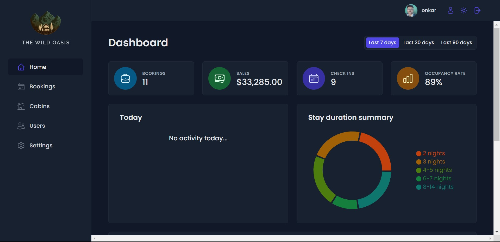
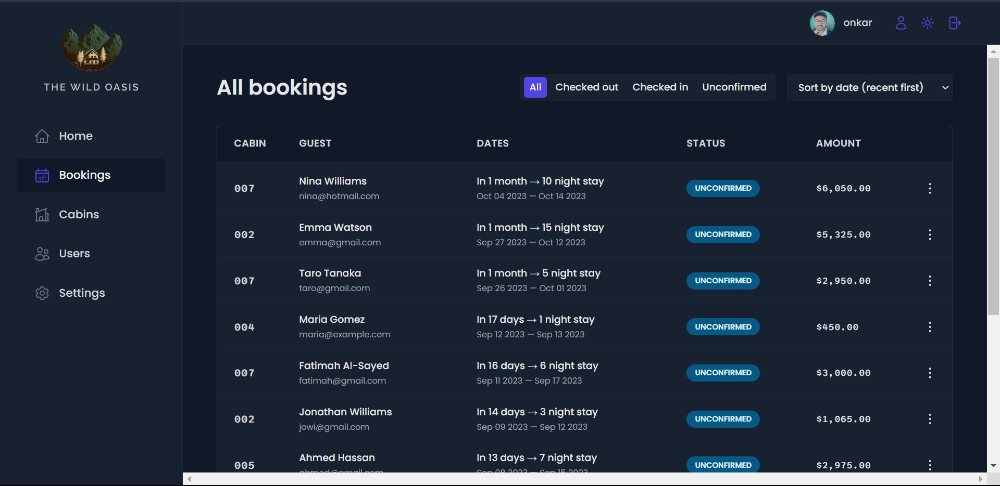
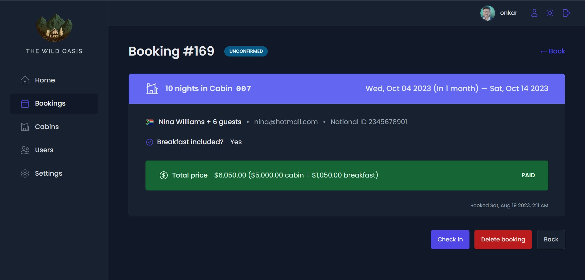

# Hotel Management System
### Built this project as part of  Jonas Schmedtmann Ultimate React Course

A web-based internal hotel management system for authorized staff to manage bookings, cabin details, and guest information.

## Introduction

The insightmanager is a web application designed to facilitate the management of hotel bookings and guest information. It allows authorized staff to view, edit, and update booking details, cabin allocations, check-in and check-out information, and more.

## Getting Started

To set up the project locally, follow these steps:

1. Clone the repository: `git clone https://github.com/Omkar0104/InsightManager.git`
2. Navigate to the project directory: `cd insightManager`
3. Install dependencies: `npm install`
4. Start the development server: `npm start`

